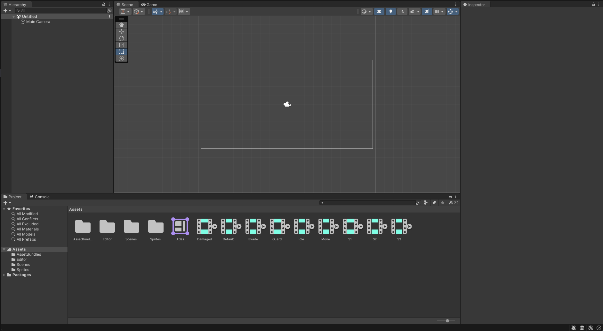
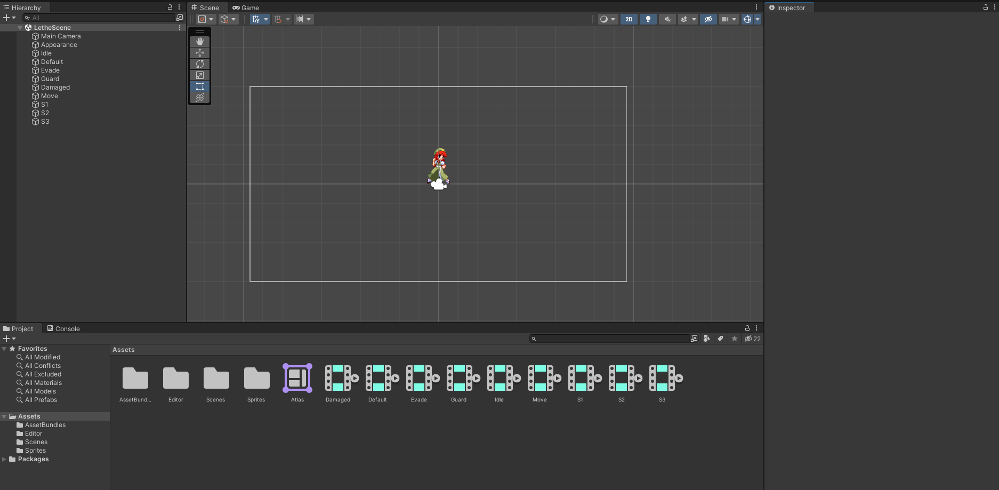

# Setting Up

## 1. Install Unity Hub

Download Unity Hub:
[https://unity.com/download](https://unity.com/download)

Install it before moving to the next step.

---

## 2. Install the Required Unity Version

After installing Unity Hub, use this link to install the correct version:

[Install Unity 2021.3.28f1](unityhub://2021.3.28f1/232e59c3f087)

Required version: **Unity 2021.3.28f1**

Wait for the installation to finish before continuing.

---

## 3. Download the Base Project

Download the base project:

[Base Project](assets/BaseMotions.zip)

Unzip it to any folder on your computer.

---

## 4. Open the Project

Open Unity Hub.
Click **Open** and select the unzipped project folder.

If everything works, you should see this:

{{#template templates/video.md id=assets/open_project.mp4}}

---

# Orienting Yourself

If the project opened correctly, your layout should look similar to this:

---

## Open the Lethe Scene

In the **Project** window:

1. Open the **Scenes** folder
2. Select the **Lethe** scene

{{#template templates/video.md id=assets/select_lethe_scene.mp4}}

---

After opening the scene, your view should look like this:

---

You are now ready to start modding.

Next, we will cover how to [Create Your First Motion](YourFirstMotion.md).
