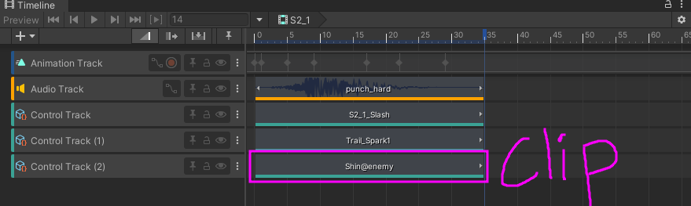

# VFX

In order to get started, it is assumed that you have **read all prior tutorials** before diving into VFX. VFX is one of if not the most complicated additions to Custom Motions yet, requiring either extensive research or prior knowledge of Unity and particle systems.

Prerequisites:
- Upgrade the current project version to this [unity version](https://unity.com/releases/editor/whats-new/6000.3.12f1) and install the Universal Render Pipeline.
- To upgrade your project to the new version, change the `editor version` in unity hub.
- To install the universal pipeline renderer, navigate to `Window` on the top bar -> `Package Management` -> `Package Manager`. After doing this, use the sidebar and navigate to the `Unity Registry` tab, then search `Universal Render Pipline` into the search bar, and install the package.
- After this, create a new asset in your assets folder by right clicking -> `create` -> `rendering` -> `URP Asset (with universal renderer)`
- Once that's done, navigate to `Edit` on the top bar -> `Project Settings` -> `Graphics` -> and change the `Set Default Render Pipeline Asset` to be your newly created URP asset.

To get started, create a new `particle system` under the `appearance` GameObject. After doing that, turn it into a `prefab` by dragging the object from the Scene into your Project tab.

Before going any further, add this prefab to your bundle. Next, click on your newly created particle system. This is where we will create the VFX needed. 

I will not be going over how to make a VFX object, as that is beyond the depth of this simple guide. If you need a VFX creation example, follow [this youtube guide](https://www.youtube.com/watch?v=9Nv28O2OIoQ), which creates a Slash VFX. Make sure to install Shader Graphs from the package manager, as it is required for the tutorial, alongside editing software of your choice to create the mask and materials.
- Note: This tutorial is slightly outdated. You may also use any other VFX tutorial for unity that uses shader graphs. If you intend to use the video, set the main material to be `canvas` instead of `unlit` for our URP pipeline, otherwise it will only appear as a purple moving circle.

Once you've created your Slash VFX following the above tutorial, and/or created your own VFX, navigate to the `overrides` tab -> `apply all` to apply all changes to the prefab as well.

Now that you've created a VFX Prefab, we now need to apply it in the timeline of your Skill animation. In order to do this:
1. Open up the timeline you intend to add the VFX to. (I.e S1, S2, etc.)
2. Under the existing `Animation Track` or any other tracks you have, right click and click `Control Track`
3. Drag your prefab from the `project` tab (the bottom tab with all your assets) into the `Control Track`
4. Adjust the timing of your VFX to match the animation, then build your asset bundle and test.

VFX in Custom Motions can have certain properties changed via editing the name of the clip, editing their positions. These require the VFX name with a postfix. The current postfixes are:

- `"VFXNAME@enemy"`, which attempts to spawn the effect on the enemy model
- `"VFXNAME@center"`, which (presumably) attempts to center the VFX on the current unit's model
- `"VFXNAME@offset_1_2_3`, offsetting the effect's location using coordinates. (X:1, Y:2, Z:3)

Offset may be combined with `enenmy` or `center`, however, `enemy` and `center` cannot be used at the same time.

An example of usage is below.

