# Your First Motion

## 1. Understanding the Project Structure

Before creating motions, let's understand the project structure.

### The `Assets` Folder

The `Assets` folder contains all the game assets.

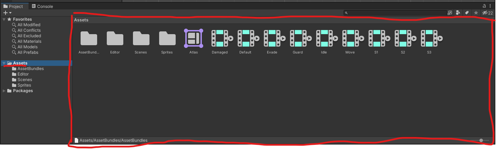

### The `Timeline` assets

These are the motion files that you will be using to create your motion.

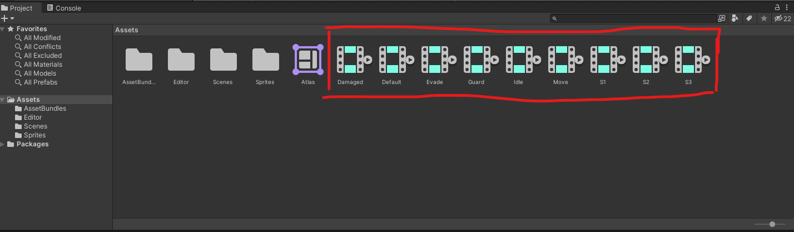

### The `Atlas` asset

This is the compressed sprites file that the game will use to display your sprites.

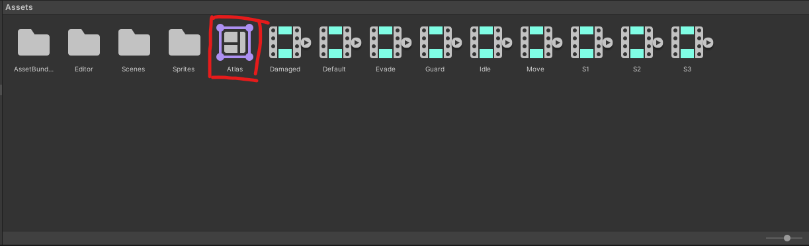

### The `Sprites` Folder

The `Sprites` folder contains the sprite files that you will be using to create your motion.

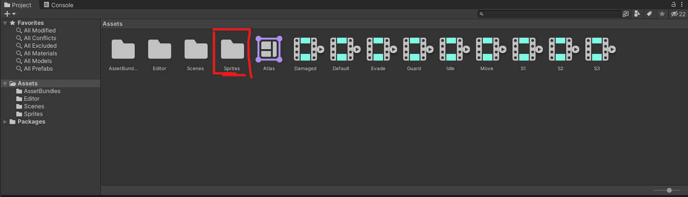

### The `Hierarchy` Window

The `Hierarchy` window is where you will see your motion game objects, as well as any other game objects in the scene.

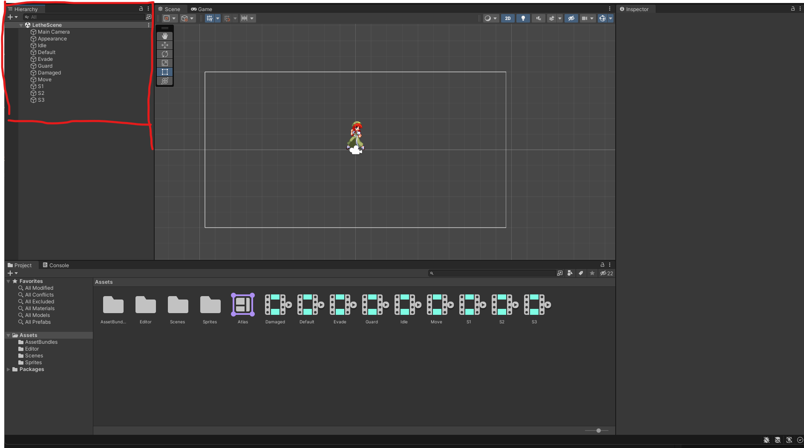

### The `Inspector` Window

The `Inspector` window is where you will see the properties of the selected game object.
It will be useful for repositioning the sprites if they appear in the wrong place in the game.

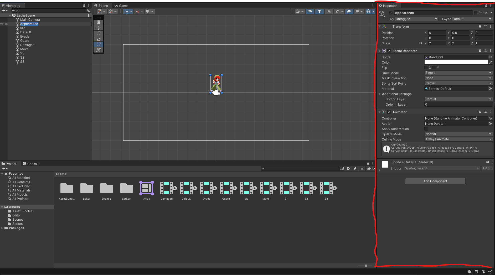

### The `Scene` Window

The `Scene` window is where you will see the game objects in the scene.

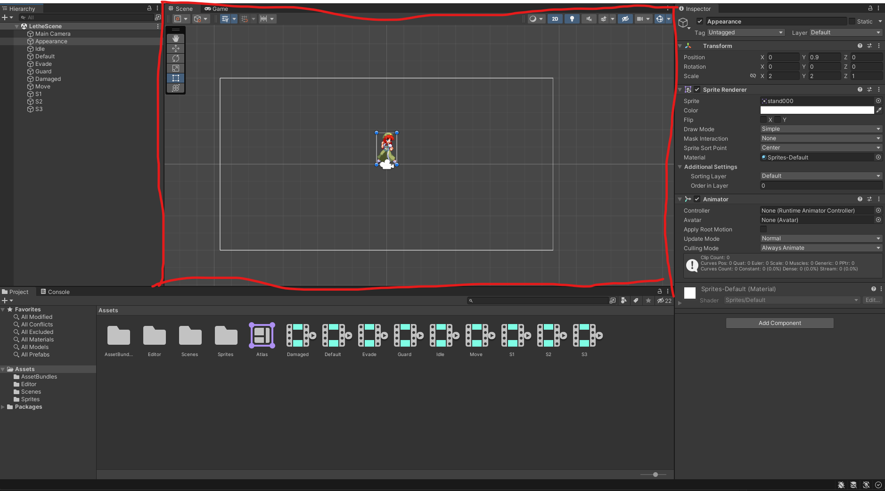

### The `Timeline` window

Let's open the timeline window and place it to the right of the scene window.

{{#template templates/video.md id=assets/open_timeline.mp4}}

The timeline window is where you will see your animations.

## 2. Exporting the Base Motion

Now that we're familiar with the project structure, let's try to export the base motion to the game.

This is as simple as right clicking the assets and clicking on "Build AssetBundles".

{{#template templates/video.md id=assets/export_base_motion.mp4}}

Create a mod folder with the following structure inside the lethe mod folder:

```
MyMotion /
    custom_motions /
        10101_YiSang_BaseAppearance /
            motion.bundle
```

This should replace your yi sang's base appearance motion with the base appearance motion of the character you exported.

Let's take it ingame and see what it looks like!

{{#template templates/video.md id=assets/ingame_base_motion.mp4}}

It works! but the idle animation is static. This is because we haven't animated the idle animation yet, let's fix that.

## 3. Animating the Idle Animation

1. Select the Idle Object from the hierarchy window.

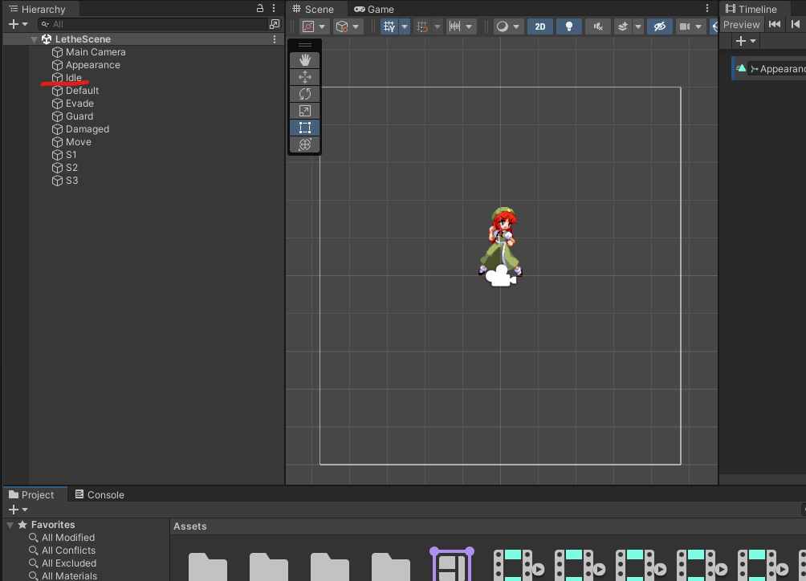

2. Now, double click on the timeline to bring up the animation editor.

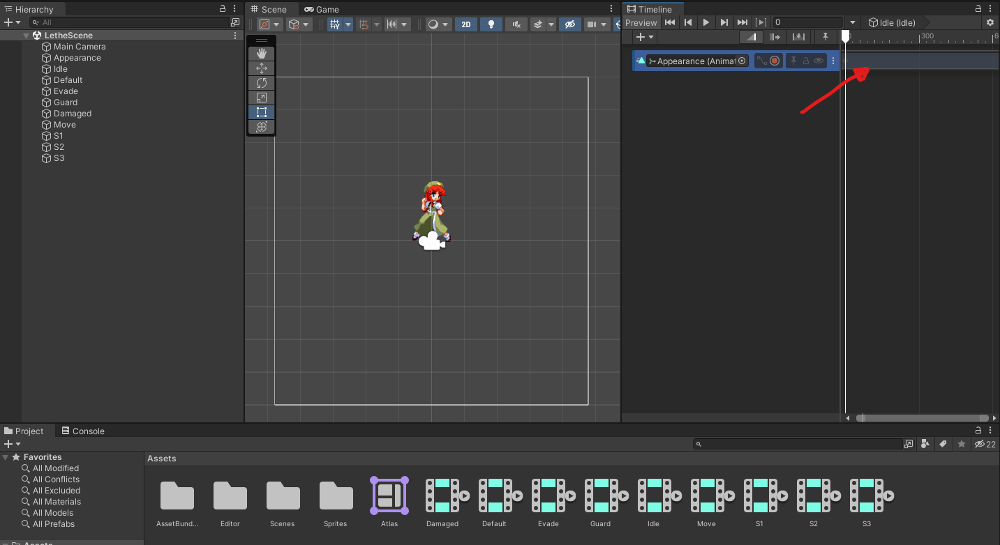

3. You'll notice that the animation tab has three rows, one for scale, one for position, and one for the sprite renderer.

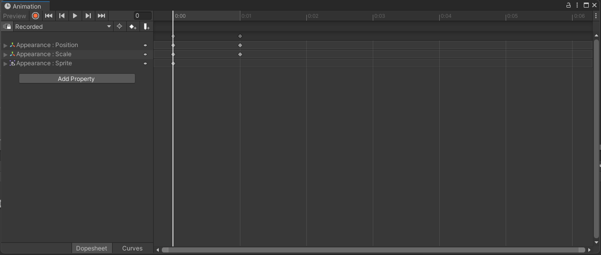

4. Click on Sprite to expand it.

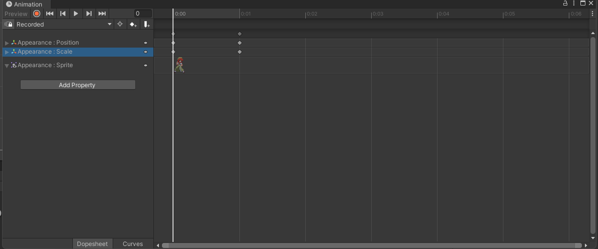

5. Now, let's head over to the sprites folder and drag the numbered stand sprites into the sprite row in the animation editor.

{{#template templates/video.md id=assets/drag_sprites.mp4}}

6. Let's play the animations to see what it looks like.

{{#template templates/video.md id=assets/play_idle_animation_1.mp4}}

7. That's too quick! Let's slow it down by dragging the keyframes further apart.

{{#template templates/video.md id=assets/play_idle_animation_2.mp4}}

8. Much better! but we haven't saved yet, notice the asterisk next to the animation tab.

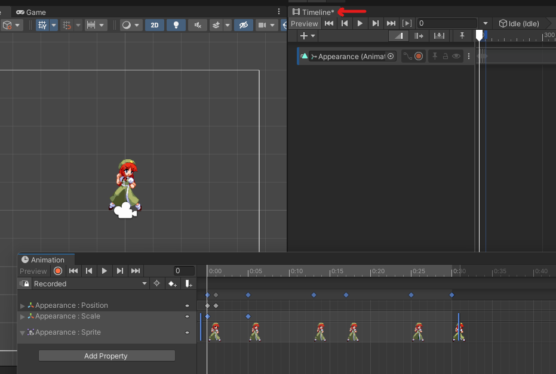

9. Let's save it by clicking ctrl+s. You'll notice that the asterisk disappears.

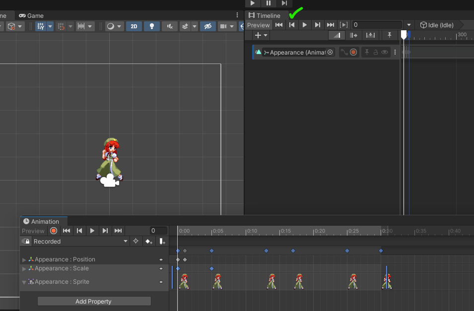

10. Now let's export it to the game (See the previous steps for instructions on how to export) and see what it looks like!

{{#template templates/video.md id=assets/ingame_idle_animation.mp4}}

11. It works! You've successfully created your first motion!

12. Your exercise is to now animate the motions `Damaged`, `Default`, `Guard`, `Evade` and `Move` with the sprites in the Sprites folder, it's just a single frame each, so it should be easy.

Next we will tackle the more complex topic of [Attacks](Attacks.md).
